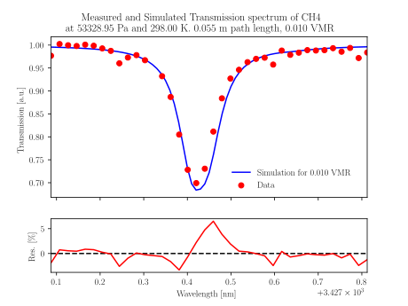
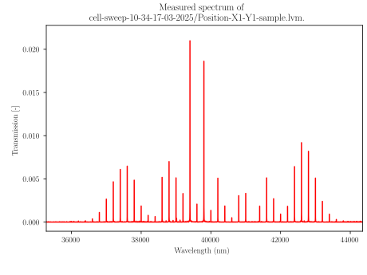
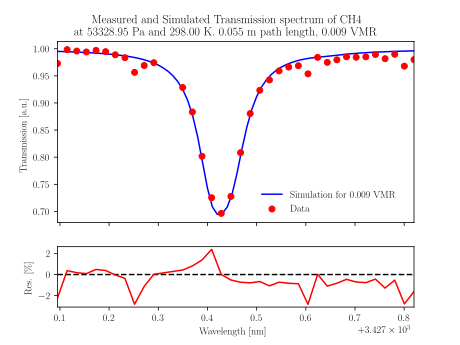

# Dual-Comb Toolkit

Useful scripts for working with dual-comb spectroscopy (DCS), including:
- Fast simulation of absorption spectra using the [Radis](https://github.com/radis/radis) library,
  compatible with GPU.
- Processing of dual-comb sample/reference measurements (baseline correction, normalization, 
  RF-to-optical mapping, noisy tooth filtering, etc).
- Fitting of processed dual-comb spectra to retrieve gas concentration.
- Mapping of concentration across multiple measurement positions to create 2D maps.
- Analysis of temporal concentration evolution within measurements. 
- Simulation of real, noisy measurements, for optimization of experimental configurations.

## Setup

Before starting, if you are going to be using the HITRAN/HITEMP databases, create a Hitran
login [here](https://hitran.org/login/). Other databases may require their own credentials.

Once you have your credentials, you can proceed with the setup below, depending on your
operating system.

<details>
<summary><b>Linux</b></summary>

1. Clone the repository:

   ```bash
   git clone https://github.com/bfrangi/dual-comb-toolkit.git
   cd dual-comb-toolkit
   ```

2. Install `virtualenv` and create a virtual environment:

   ```bash
   sudo apt-get update
   sudo apt-get install python3-venv
   python3.10 -m venv .venv
   source .venv/bin/activate
   ```

3. Install dependencies and apply the radis patch (this second part is optional):

   ```bash
   pip install -r requirements.txt
   ```

4. [Optional] If you want to use LaTeX for plotting, install the `texlive` package:

   ```bash
   sudo apt-get update
   sudo apt-get install texlive-latex-extra texlive-fonts-extra dvipng
   ```

</details>

<details>
<summary><b>Windows</b></summary>

1. Clone the repository:

   ```bash
   git clone https://github.com/bfrangi/dual-comb-toolkit.git
   cd dual-comb-toolkit
   ```

2. Install `python3.12` from the Microsoft Store.

3. Create a virtual environment:

   ```bash
   python3.12 -m venv .venv
   .\.venv\Scripts\activate.bat
   ```

4. Install dependencies and apply the radis patch (this second part is optional):

   ```bash
   pip install -r requirements-win.txt
   ```

5. [Optional] If you want to use LaTeX for plotting, install the `texlive` package by downloading
   the installer from [here](https://www.tug.org/texlive/windows.html) or the ISO from 
   [here](https://www.tug.org/texlive/acquire-iso.html) and following the installation
   instructions.

</details>

<br>

**Note**: Using LaTeX for plotting is optional, and slows down the plotting process significantly.
It is recommended only for generating publication-quality figures.

## Usage

If using HITRAN/HITEMP, you will need to log in with your HITRAN credentials the first time you
simulate an absorption spectrum. Other databases may require their own credentials.

**Note**: The first time you run the simulator, the database will be downloaded, and this could
take some time. Please be patient!

<details>
<summary><b>Line simulation</b></summary>

You can simulate absorption spectra using the `src/line-simulator.py` script. You can define the
simulation parameters directly in the script. Navigate to the `src` directory and run the script
as follows:

```bash
python line-simulator.py
```

</details>

<details>
<summary><b>Manual measurement processing</b></summary>

You can manually process dual-comb measurements using the `src/process-measurement.py` script. You
can define the measurement parameters directly in the script, including the path to the measurement 
to process and the path to the set of measurements to use for baseline correction. This last part is
useful to remove etalon effects and other systematic noise from the measurement. Navigate to the 
`src` directory and run the script as follows:

```bash
python process-measurement.py
```

Here is an example of the output plot:



To characterize the baseline, there is also the `src/process-baseline.py` script. You can run it as
follows:

```bash
python process-baseline.py
```

And there is also a simple script to view the raw spectrum of any measurement, `src/measurement-spectrum.py`:

```bash
python measurement-spectrum.py
```

An example of the output plot from this script is shown below:



</details>

<details>
<summary><b>Concentration fitting</b></summary>

You can fit processed dual-comb measurements to retrieve gas concentration using the
`src/fit-measurement.py` script. You can define the fitting parameters directly in the script,
very similarly to the `src/process-measurement.py` script. Navigate to the `src` directory and run
the script as follows:

```bash
python fit-measurement.py
```

Here is an example of the output plot:



</details>

<details>
<summary><b>2D Concentration mapping</b></summary>

You can map concentration across multiple measurement positions using the `src/map-measurement.py`
script. You can define the mapping parameters directly in the script. To ensure correct mapping, the
measurements should be named according to their position, e.g., `Position-X1-Y1`, `Position-X2-Y5`, 
etc. Navigate to the `src` directory and run the script as follows:

```bash
python map-measurement.py
```

A report is generated in the `reports/` directory, containing the concentration map and configuration
details. Here is an example:

```txt
Mapping Report
---------------------------------------
Generated on 2025-12-19 17:47:44

Molecule: CH4
Pressure: 53328.94736842 Pa
Temperature: 298 K
Path length: 0.055 m

Optical Comb spacing: 0.5 GHz
Number of teeth: 38
Laser wavelength: 3427.4500000000003 m
Minimum wavelength: 3427.0 nm
Maximum wavelength: 3427.9 nm

RF central frequency: 40000.0 Hz
RF comb spacing: 200.0 Hz
Acquisition frequency: 400000.0 Hz

Fitter: normal_gpu
Initial guess: 0.0001 VMR
Lower bound: 0 VMR
Upper bound: 1 VMR
Number of sub-measurements: 10
Tooth standard deviation threshold: inf
Removed tooth indices: [9, 12, 13]
Baseline measurements used: 6
 - cell-sweep-10-34-17-03-2025/Position-X11-Y1
 - cell-sweep-10-34-17-03-2025/Position-X12-Y1
 - cell-sweep-10-34-17-03-2025/Position-X13-Y1
 - cell-sweep-10-34-17-03-2025/Position-X14-Y1
 - cell-sweep-10-34-17-03-2025/Position-X15-Y1
 - cell-sweep-10-34-17-03-2025/Position-X16-Y1
---------------------------------------

cell-sweep-10-34-17-03-2025/Position-X1-Y1	0.009261 VMR
cell-sweep-10-34-17-03-2025/Position-X2-Y1	0.009597 VMR
cell-sweep-10-34-17-03-2025/Position-X3-Y1	0.009233 VMR
cell-sweep-10-34-17-03-2025/Position-X4-Y1	0.009390 VMR
cell-sweep-10-34-17-03-2025/Position-X5-Y1	0.009983 VMR
cell-sweep-10-34-17-03-2025/Position-X6-Y1	0.010781 VMR
cell-sweep-10-34-17-03-2025/Position-X7-Y1	0.000000 VMR
cell-sweep-10-34-17-03-2025/Position-X8-Y1	0.000000 VMR
cell-sweep-10-34-17-03-2025/Position-X9-Y1	0.000000 VMR
cell-sweep-10-34-17-03-2025/Position-X10-Y1	0.002576 VMR
cell-sweep-10-34-17-03-2025/Position-X11-Y1	0.000494 VMR
cell-sweep-10-34-17-03-2025/Position-X12-Y1	0.000385 VMR
cell-sweep-10-34-17-03-2025/Position-X13-Y1	0.000090 VMR
cell-sweep-10-34-17-03-2025/Position-X14-Y1	0.000162 VMR
cell-sweep-10-34-17-03-2025/Position-X15-Y1	0.000228 VMR
cell-sweep-10-34-17-03-2025/Position-X16-Y1	0.000409 VMR

End of report.
---------------------------------------
```

</details>

<details>
<summary><b>Time evolution of concentration</b></summary>

You can analyze the temporal evolution of concentration within measurements using the
`src/measurement-evolution.py` script. You can define the analysis parameters directly in the
script. Navigate to the `src` directory and run the script as follows:

```bash
python measurement-evolution.py
```

Here is an example of the output `.csv` file and animation:

```csv
Time [s],Concentration [VMR]
0.000000000000000000e+00,6.840625000000015964e-03
2.500000000000000139e-02,7.136250000000015845e-03
5.000000000000000278e-02,7.959375000000018519e-03
7.500000000000001110e-02,8.620000000000020007e-03
1.000000000000000056e-01,7.585000000000017076e-03
1.250000000000000000e-01,7.333125000000017581e-03
1.500000000000000222e-01,7.904375000000015555e-03
1.750000000000000167e-01,9.492500000000021754e-03
...
```


</details>

## Using GPU Acceleration

Check out the `GPU_DEVICE_ID` setting in `src/lib/defaults.py`. By default, it is set to `"nvidia"`
which will use the NVIDIA GPU if available. If you want to use a different GPU, run the
`src/identify-gpu.py` script to list available GPUs and set the `GPU_DEVICE_ID` accordingly (it can 
be the number of the GPU in the output list or a string contained in the name of the device).

## Issues with plots

If you encounter `UserWarning: FigureCanvasAgg is non-interactive, and thus cannot be shown plt.show()`,
just install `PyQt6`:

```bash
pip install PyQt6
```

## Issues with LaTeX (on Linux)

If you encounter `FileNotFoundError: Matplotlib's TeX implementation searched for a file named 'cmr10.tfm' in your texmf tree, but could not find it.`, just run the [following command](https://stackoverflow.com/a/79243265/15159198):

```bash
sudo mv /usr/bin/luatex /usr/bin/luatex.bk 
```

If you encounter `LaTeX Error: File 'type1ec.sty' not found.`, install the `cm-super` package (see [here](https://github.com/matplotlib/matplotlib/issues/16911)):

```bash
sudo apt install cm-super
```

If you encounter `RuntimeError: Failed to process string with tex because dvipng could not be found`, install the `dvipng` package:

```bash
sudo apt install dvipng
```

## Acknowledgements

This project uses the [RADIS](https://github.com/radis/radis) library for
high-resolution molecular spectroscopy calculations.
